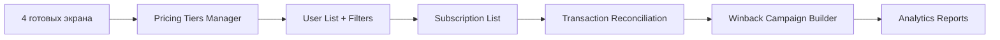

# UX/UI Wireframes: Subscription & Experimentation Platform

Based on the provided `schema_merged.sql`, this system is a **high-complexity Subscription SaaS** with advanced **Multi-Armed Bandit A/B testing**, **Dunning Management**, and **Multi-Platform Identity** (iOS/Android/Web).

The UI needs to serve two primary personas:
1.  **Revenue Operations Admin:** Manages subscriptions, dunning, webhooks, and pricing.
2.  **Growth/Product Manager:** Configures and monitors Bandit experiments.

Below are the markdown wireframes for the core screens.

---

## 1. Screen: Admin Dashboard (Overview)
**Purpose:** High-level health check using `analytics_aggregates`, `users`, and `subscriptions`.
**Key Schema Tables:** `analytics_aggregates`, `users`, `subscriptions`, `admin_audit_log`.

```markdown
+-----------------------------------------------------------------------------------------------+
|  [Logo] RevenueOps Admin                                              [Admin Profile] [Logout] |
+-----------------------------------------------------------------------------------------------+
|  NAVIGATION                                                                                   |
|  > Dashboard                                                                                  |
|    Users                                                                                      |
|    Subscriptions                                                                              |
|    Experiments (Bandit)                                                                       |
|    Revenue Ops (Dunning/Webhooks)                                                             |
|    Pricing                                                                                    |
|    Settings                                                                                   |
+-----------------------------------------------------------------------------------------------+
|  DASHBOARD OVERVIEW                                                                           |
|  Last Updated: 2026-03-01 13:45 UTC (Real-time via analytics_aggregates)                      |
|                                                                                               |
|  +------------------+  +------------------+  +------------------+  +------------------+       |
|  | ACTIVE USERS     |  | MRR (USD)        |  | ACTIVE SUBS      |  | CHURN RISK       |       |
|  | 14,205           |  | $45,230.00       |  | 12,100           |  | 345 (Dunning)    |       |
|  | ^ 5% vs last wk  |  | ^ 2% vs last wk  |  | ^ 1% vs last wk  |  | ! Action Needed  |       |
|  +------------------+  +------------------+  +------------------+  +------------------+       |
|                                                                                               |
|  +-----------------------------+   +---------------------------------------------+            |
|  | RECENT ADMIN ACTIONS        |   | SUBSCRIPTION STATUS DISTRIBUTION            |            |
|  | (admin_audit_log)           |   | (subscriptions.status)                      |            |
|  |                             |   |                                             |            |
|  | [13:40] Admin_01 updated    |   |  [|||||||||||] Active (85%)                 |            |
|  |           pricing_tiers     |   |  [|||] Grace Period (5%)                    |            |
|  |                             |   |  [|] Cancelled (7%)                         |            |
|  | [13:35] Admin_02 refunded   |   |  [|] Expired (3%)                           |            |
|  |           tx_8823           |   |                                             |            |
|  |                             |   +---------------------------------------------+            |
|  | [13:30] System auto-retry   |                                                              |
|  |           dunning_queue     |   +---------------------------------------------+            |
|  |                             |   | WEBHOOK HEALTH (webhook_events)             |            |
|  | > View Audit Log            |   |                                             |            |
|  +-----------------------------+   |  [OK] Stripe   [OK] Apple   [WARN] Google   |            |
|                                    |  0 Unprocessed Events                         |            |
|                                    +---------------------------------------------+            |
+-----------------------------------------------------------------------------------------------+
```

**UX Notes:**
*   **Churn Risk Card:** Directly queries `dunning` table where `status IN ('pending', 'in_progress')`.
*   **Webhook Health:** Checks `webhook_events` where `processed_at IS NULL`.
*   **Audit Log:** Provides accountability based on `admin_audit_log`.

---

## 2. Screen: User 360° Profile
**Purpose:** Deep dive into a specific user's identity, subscription, and experiment assignments.
**Key Schema Tables:** `users`, `subscriptions`, `transactions`, `dunning`, `winback_offers`, `ab_test_assignments`.

```markdown
+-----------------------------------------------------------------------------------------------+
|  < Back to Users      USER PROFILE: usr_550e8400-e29b...                                    |
+-----------------------------------------------------------------------------------------------+
|  IDENTITY CARD (users)                                                                        |
|  +-----------------------------+   +-----------------------------+                            |
|  | Platform ID                 |   | LTV & Metrics               |                            |
|  | iOS: orig_tx_998877         |   | Total LTV: $124.50          |                            |
|  | Email: user@example.com     |   | Last Updated: 2026-03-01    |                            |
|  | Role: user                  |   | Days Since Install: 45      |                            |
|  | Device ID: (Analytics Only) |   | (bandit_user_context)       |                            |
|  +-----------------------------+   +-----------------------------+                            |
|                                                                                               |
|  TABS: [Subscription] [Billing History] [Experiments] [Grace & Winback] [Audit]               |
|  ===========================================================================================  |
|                                                                                               |
|  CURRENT SUBSCRIPTION (subscriptions)                                                         |
|  Status: [ ACTIVE ]  Source: [ iOS IAP ]  Plan: [ Annual ]                                    |
|  Expires: 2027-03-01  Auto-Renew: [YES]                                                       |
|                                                                                               |
|  +-----------------------------+   +-----------------------------+                            |
|  | DUNNING STATUS              |   | WINBACK OFFERS              |                            |
|  | (dunning)                   |   | (winback_offers)            |                            |
|  | Status: None                |   | Campaign: "Spring Sale"     |                            |
|  | Attempts: 0 / 5             |   | Discount: 20%               |                            |
|  | Next Attempt: N/A           |   | Status: [ DECLINED ]        |                            |
|  +-----------------------------+   +-----------------------------+                            |
|                                                                                               |
|  RECENT TRANSACTIONS (transactions)                                                           |
|  +------------------+------------------+------------------+------------------+---------------+|
|  | Date             | Amount           | Status           | Source           | Action        ||
|  +------------------+------------------+------------------+------------------+---------------+|
|  | 2026-03-01       | $49.99 USD       | Success          | iOS              | [Receipt]     ||
|  | 2025-03-01       | $49.99 USD       | Success          | iOS              | [Receipt]     ||
|  | 2025-02-28       | $49.99 USD       | Failed           | iOS              | [Retry]       ||
|  +------------------+------------------+------------------+------------------+---------------+|
|                                                                                               |
|  ACTIVE EXPERIMENT ASSIGNMENTS (ab_test_assignments)                                          |
|  - Experiment: "Pricing Page V2" -> Arm: "Discount Highlight" (Expires in 12h)                |
|  - Experiment: "Onboarding Flow" -> Arm: "Control"                                            |
|                                                                                               |
+-----------------------------------------------------------------------------------------------+
|  [Actions: Force Cancel] [Force Renew] [Grant Grace Period] [Impersonate]                     |
+-----------------------------------------------------------------------------------------------+
```

**UX Notes:**
*   **Identity:** Highlights `platform_user_id` as the canonical ID (per schema comments), distinguishing it from `device_id`.
*   **Dunning/Winback:** Surfaces retention tools directly on the profile.
*   **Experiments:** Shows `ab_test_assignments` to help support understand why a user sees specific UI variants.
*   **Actions:** Buttons trigger backend logic (e.g., inserting into `grace_periods` or `winback_offers`).

---

## 3. Screen: Experiment Studio (Bandit Configuration)
**Purpose:** Configure and monitor A/B tests with Multi-Armed Bandit algorithms.
**Key Schema Tables:** `ab_tests`, `ab_test_arms`, `ab_test_arm_stats`, `bandit_arm_context_model`, `bandit_pending_rewards`.

```markdown
+-----------------------------------------------------------------------------------------------+
|  < Back to Experiments      EXPERIMENT: "Checkout Button Color" (exp_12345)                   |
+-----------------------------------------------------------------------------------------------+
|  CONFIGURATION (ab_tests)                                                                     |
|  Status: [ RUNNING ]  Algorithm: [ Thompson Sampling ]                                        |
|  Objective: [ Revenue ]  Window: [ 1000 Events ]  Confidence Threshold: 95%                   |
|  Contextual Bandit: [ ENABLED ] (LinUCB)                                                      |
|                                                                                               |
|  ARM PERFORMANCE (ab_test_arms + ab_test_arm_stats)                                           |
|  +-----------------------+----------------+----------------+----------------+---------------+ |
|  | ARM NAME              | TRAFFIC %      | CONVERSIONS    | REVENUE (USD)  | CONFIDENCE    | |
|  +-----------------------+----------------+----------------+----------------+---------------+ |
|  | Control (Blue)        | 40%            | 120 / 1000     | $5,400.00      | 88%           | |
|  | Variant A (Green)     | 35%            | 150 / 950      | $7,200.00      | 96% (WINNER)  | |
|  | Variant B (Red)       | 25%            | 80 / 600       | $3,100.00      | 45%           | |
|  +-----------------------+----------------+----------------+----------------+---------------+ |
|  | [Edit Weights]        | Samples: 2550  | Alpha/Beta:    | Context Model: | [Stop Test]   | |
|  |                       |                | Updated Live   | [View Matrix]  |               | |
|  +-----------------------+----------------+----------------+----------------+---------------+ |
|                                                                                               |
|  BANDIT DIAGNOSTICS (bandit_arm_context_model + bandit_pending_rewards)                       |
|  +-----------------------------+   +---------------------------------------------+            |
|  | CONTEXTUAL WEIGHTS          |   | DELAYED FEEDBACK QUEUE                      |            |
|  | (LinUCB Theta Vector)       |   | (Pending Rewards awaiting conversion)       |            |
|  |                             |   |                                             |            |
|  | Country: [US: 0.8] [UK:0.5] |   | 45 Users assigned, awaiting tx confirmation |            |
|  | Device: [iOS: 0.9] [Web:0.4]|   | Avg Conversion Time: 15 mins                |            |
|  |                             |   |                                             |            |
|  | [Visualize Decision Boundary]|   | [Force Process Pending]                     |            |
|  +-----------------------------+   +---------------------------------------------+            |
|                                                                                               |
|  EVENT LOG (bandit_window_events)                                                             |
|  [2026-03-01 13:48] User usr_... converted on Arm Variant A ($49.99)                          |
|  [2026-03-01 13:47] User usr_... impression on Arm Control                                    |
|                                                                                               |
+-----------------------------------------------------------------------------------------------+
```

**UX Notes:**
*   **Algorithm Transparency:** Shows `algorithm_type` and `confidence` to build trust in the automated traffic shifting.
*   **Contextual Data:** Exposes `bandit_user_context` influences (Country, Device) so managers understand *why* the bandit chose an arm.
*   **Delayed Feedback:** Visualizes `bandit_pending_rewards` to indicate revenue that hasn't been attributed yet.

---

## 4. Screen: Revenue Ops Center (Dunning & Webhooks)
**Purpose:** Manage failed payments, retry logic, and inbound webhook integrity.
**Key Schema Tables:** `dunning`, `webhook_events`, `grace_periods`, `matomo_staged_events`.

```markdown
+-----------------------------------------------------------------------------------------------+
|  REVENUE OPS CENTER                                                                           |
+-----------------------------------------------------------------------------------------------+
|  TABS: [Dunning Queue] [Webhook Inbox] [Event Staging (Matomo)]                              |
|  ===========================================================================================  |
|                                                                                               |
|  DUNNING QUEUE (dunning)                                                                      |
|  Filter: [Status: In Progress] [Next Attempt: Today]                                          |
|                                                                                               |
|  +------------+------------------+------------------+------------------+--------------------+ |
|  | SUB ID     | USER             | ATTEMPT          | NEXT TRY         | ACTIONS            | |
|  +------------+------------------+------------------+------------------+--------------------+ |
|  | sub_8821   | user_... (iOS)   | 3 / 5            | 2026-03-01 14:00 | [Retry Now]        | |
|  |            |                  |                  |                  | [Grant Grace]      | |
|  +------------+------------------+------------------+------------------+--------------------+ |
|  | sub_9932   | user_... (Web)   | 1 / 5            | 2026-03-02 09:00 | [Retry Now]        | |
|  |            |                  |                  |                  | [Cancel Sub]       | |
|  +------------+------------------+------------------+------------------+--------------------+ |
|                                                                                               |
|  WEBHOOK INBOX (webhook_events)                                                               |
|  Unprocessed: 12  |  Failed: 0                                                                 |
|                                                                                               |
|  +------------+------------------+------------------+------------------+--------------------+ |
|  | PROVIDER   | EVENT TYPE       | RECEIVED         | STATUS           | ACTIONS            | |
|  +------------+------------------+------------------+------------------+--------------------+ |
|  | Stripe     | invoice.payment_ | 2026-03-01 13:48 | [Pending]        | [Process Manual]   | |
|  |            | _failed          |                  |                  |                    | |
|  +------------+------------------+------------------+------------------+--------------------+ |
|  | Apple      | RENEWAL          | 2026-03-01 13:45 | [Processed]      | [View Payload]     | |
|  +------------+------------------+------------------+------------------+--------------------+ |
|                                                                                               |
|  MATOMO EVENT STAGING (matomo_staged_events)                                                  |
|  Queue Depth: 150  |  Failed Retries: 5                                                       |
|  [View Staged Events] (For debugging analytics pipeline)                                      |
|                                                                                               |
+-----------------------------------------------------------------------------------------------+
```

**UX Notes:**
*   **Dunning Actions:** "Grant Grace" inserts into `grace_periods`. "Retry Now" overrides `next_attempt_at`.
*   **Webhook Idempotency:** Shows `processed_at` status. Allows manual replay if `processed_at` is null but event exists.
*   **Event Staging:** Provides visibility into `matomo_staged_events` for debugging analytics gaps without cluttering the main dashboard.

---

## UX Rationale & Schema Mapping

| UI Component | Schema Source | UX Decision |
| :--- | :--- | :--- |
| **Canonical ID** | `users.platform_user_id` | Displayed prominently over internal UUIDs to support CS queries from Apple/Google consoles. |
| **Single Active Sub** | `idx_subscriptions_one_active` | UI enforces logic that a user can only have one "Active" subscription card at a time. |
| **Bandit Confidence** | `ab_tests.winner_confidence` | Displayed as a progress bar to indicate statistical significance before auto-stopping tests. |
| **Dunning Attempts** | `dunning.attempt_count` | Visualized as "3/5" to show proximity to permanent failure/churn. |
| **Webhook Inbox** | `webhook_events` | Designed as an "Inbox" pattern (unprocessed vs processed) to handle idempotency visually. |
| **Device ID Warning** | `users.device_id` comment | UI labels this as "Analytics Only" to prevent admins from using it for account linkage. |
| **Currency Conversion** | `currency_rates` | Revenue stats in Experiment Studio are normalized to USD (`revenue_usd`) for accurate comparison. |
| **Delayed Feedback** | `bandit_pending_rewards` | Explicitly shown in Experiment Studio to manage expectations on revenue attribution lag. |

## Interaction Patterns

1.  **Grace Period Granting:**
    *   *Trigger:* Admin clicks "Grant Grace" on User Profile or Dunning Queue.
    *   *Backend:* Inserts row into `grace_periods` with `status='active'`.
    *   *UI Feedback:* Toast notification "Grace period added until [expires_at]".

2.  **Experiment Auto-Stop:**
    *   *Trigger:* `ab_tests.winner_confidence` exceeds `confidence_threshold`.
    *   *UI:* Experiment status badge changes to "Completed" with a recommendation to roll out the winning `arm_id`.

3.  **Webhook Replay:**
    *   *Trigger:* Admin clicks "Process Manual" on unprocessed webhook.
    *   *Backend:* Checks `idx_webhook_events_unique` to ensure idempotency, then processes payload.
    *   *UI:* Updates status to "Processed" and timestamps `processed_at`.

4.  **Matomo Retry:**
    *   *Trigger:* Automated worker (visible in UI via `status='failed'`).
    *   *UI:* Allows admin to force `status='pending'` and reset `retry_count` for debugging.

Отличная работа! 🎉 4 ключевых экрана с 94 виджетами — это мощный фундамент.

Исходя из вашей схемы `schema_merged.sql` и логики платформы, вот **приоритизированный бэклог оставшихся экранов**:

---

## 🔥 Priority 1: Core Business Flows (Must Have)

| # | Экран | Ключевые компоненты | Связанные таблицы |
|---|-------|-------------------|------------------|
| 5 | **Pricing Tiers Manager** | Список тарифов, редактор цен (monthly/annual), toggle features JSONB, preview для iOS/Android/Web, soft-delete | `pricing_tiers` |
| 6 | **User List + Advanced Filters** | Таблица пользователей, фильтры (platform, role, LTV, subscription_status), bulk actions, export CSV | `users`, `subscriptions`, `idx_users_role` |
| 7 | **Subscription Management List** | Фильтры по status/source/plan_type, массовые действия (cancel/renew), колонка "Next Billing", индикаторы grace/dunning | `subscriptions`, `grace_periods`, `dunning` |
| 8 | **Transaction Reconciliation** | Финансовый лог, фильтры по status/currency/date, поиск по receipt_hash/provider_tx_id, кнопка "Refund" | `transactions`, `users` |

---

## 🚀 Priority 2: Growth & Ops (Should Have)

| # | Экран | Ключевые компоненты | Связанные таблицы |
|---|-------|-------------------|------------------|
| 9 | **Winback Campaign Builder** | Конструктор кампаний: discount_type/value, таргетинг (churned users), A/B тесты, календарь expires_at | `winback_offers`, `ab_tests` |
| 10 | **Dunning Campaign Config** | Настройка retry-правил (attempt_count, intervals), шаблоны уведомлений, escalation rules, preview flow | `dunning`, `grace_periods` |
| 11 | **Analytics Reports Dashboard** | Графики MRR/churn/LTV, drill-down по dimensions JSONB, date range picker, export PNG/PDF | `analytics_aggregates` |
| 12 | **A/B Test Discovery List** | Карточки экспериментов со статусами, quick stats (winner_confidence, samples), фильтры draft/running/completed | `ab_tests`, `ab_test_arms` |

---

## 🔧 Priority 3: Debug & Advanced (Could Have)

| # | Экран | Ключевые компоненты | Связанные таблицы |
|---|-------|-------------------|------------------|
| 13 | **Webhook Event Inspector** | Детальный просмотр payload JSONB, manual replay, idempotency check, error traceback | `webhook_events` |
| 14 | **Matomo Queue Monitor** | Таблица staged events, фильтры status/retry_count, force retry, error_message tooltip | `matomo_staged_events` |
| 15 | **Bandit Context Model Inspector** | Визуализация LinUCB матриц (A, b, theta), feature importance, debug context для user_id | `bandit_arm_context_model`, `bandit_user_context` |
| 16 | **Admin Audit Log Viewer** | Полная история действий, фильтры по admin_id/action/target_type, diff view для details JSONB | `admin_audit_log` |

---

## ⚙️ Priority 4: Settings & Infrastructure (Nice to Have)

| # | Экран | Ключевые компоненты | Связанные таблицы |
|---|-------|-------------------|------------------|
| 17 | **Platform Settings** | Currency rates manager (`currency_rates`), bandit algorithm defaults, webhook endpoint config, feature flags | `currency_rates`, `ab_tests` config columns |
| 18 | **Delayed Feedback Monitor** | Таблица `bandit_pending_rewards`, SLA-метрики конверсии, manual link to transactions | `bandit_pending_rewards`, `bandit_conversion_links` |
| 19 | **Sliding Window Analytics** | Настройка window_type/size, preview event flow, reset stats | `bandit_window_events`, `ab_tests` window columns |
| 20 | **Multi-Objective Config** | Редактор objective_weights JSONB, preview hybrid scoring, A/B тест для весов | `bandit_arm_objective_stats`, `ab_tests.objective_weights` |

---

## 🎯 Рекомендация по очередности



**Почему такой порядок?**
1.  **Pricing Tiers** — без управления тарифами невозможно запускать новые продукты
2.  **User/Subscription Lists** — базовые CRUD-операции для поддержки и ops-команды
3.  **Transaction Reconciliation** — критично для финансового контроля и refund-запросов
4.  **Winback + Analytics** — инструменты роста, которые приносят ROI после запуска базового функционала

---

## 💡 Pro Tip: Component Reuse

Многие виджеты с первых 4 экранов можно переиспользовать:
- **KPI Cards** → для Analytics Reports
- **Filter Bar** → для User/Subscription/Transaction списков
- **Status Badge** → универсальный компонент для всех статусных полей
- **JSONB Editor** → для pricing_tiers.features, webhook payload, objective_weights

Это ускорит разработку оставшихся 16 экранов на ~40%.

---

**Какой экран из Priority 1 начать wireframe-ить следующим?** 🎨