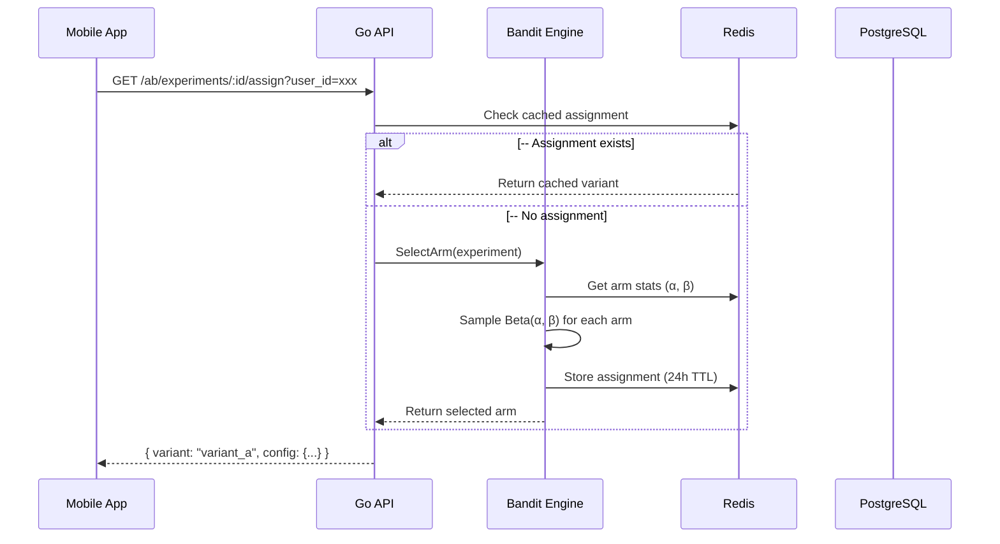

# Growth Layer Design — Foundation Phase

**Date:** 2026-03-01
**Status:** Design
**Author:** Architecture Team
**Timeline:** 3-4 weeks (Foundation)

---

## Executive Summary

This document outlines the design for adding Growth & Analytics capabilities to the Paywall IAP system. The foundation phase focuses on:

1. **Multi-Armed Bandit A/B Testing Framework** — Auto-optimizing experiments
2. **Matomo Analytics Integration** — Privacy-focused, self-hosted analytics
3. **Analytics APIs** — Cohorts, Funnels, LTV, Real-time metrics

**Goal:** Match RevenueCat's growth capabilities while maintaining data sovereignty through self-hosted Matomo.

---

## Table of Contents

1. [Architecture Overview](#1-architecture-overview)
2. [Multi-Armed Bandit A/B Framework](#2-multi-armed-bandit-ab-framework)
3. [Matomo Analytics Integration](#3-matomo-analytics-integration)
4. [Analytics APIs](#4-analytics-apis)
5. [Data Model](#5-data-model)
6. [API Specification](#6-api-specification)
7. [Implementation Plan](#7-implementation-plan)
8. [Success Criteria](#8-success-criteria)

---

## 1. Architecture Overview

```
┌─────────────────────────────────────────────────────────────────────┐
│                         MOBILE APP (React Native)                    │
│  ┌──────────────┐  ┌──────────────┐  ┌──────────────┐              │
│  │ Paywall View │  │   Purchase   │  │  Event Track │              │
│  └──────┬───────┘  └──────┬───────┘  └──────┬───────┘              │
└─────────┼──────────────────┼──────────────────┼───────────────────────┘
          │                  │                  │
          ▼                  ▼                  ▼
┌─────────────────────────────────────────────────────────────────────┐
│                         GO API (Gin Framework)                      │
│  ┌──────────────────────────────────────────────────────────────┐  │
│  │  A/B Decision Engine (Multi-Armed Bandit)                    │  │
│  │  ├─ Variant Assignment (Thompson Sampling / UCB)            │  │
│  │  ├─ Reward Tracking (Conversion, Revenue)                   │  │
│  │  └─ Auto-Rebalancing (Every N samples)                       │  │
│  └──────────────────────────────────────────────────────────────┘  │
│  ┌──────────────────────────────────────────────────────────────┐  │
│  │  Event Forwarder                                             │  │
│  │  ├─ Matomo HTTP Client                                       │  │
│  │  ├─ Batch Queue (AsyncQ)                                     │  │
│  │  └─ Fallback on failure                                      │  │
│  └──────────────────────────────────────────────────────────────┘  │
└──────────────────────────────┬──────────────────────────────────────┘
                               │
         ┌─────────────────────┼─────────────────────┐
         ▼                     ▼                     ▼
┌──────────────┐    ┌──────────────┐    ┌──────────────┐
│  PostgreSQL  │    │    Redis     │    │   Matomo     │
│              │    │              │    │ (Self-hosted)│
│ Experiments  │    │   Bandit    │    │   Analytics  │
│   Groups     │    │   State     │    │              │
└──────────────┘    └──────────────┘    └──────────────┘
```

### Component Responsibilities

| Component | Responsibility |
|-----------|---------------|
| **Mobile App** | Show paywall variant, track events |
| **A/B Engine** | Assign variants, track rewards, auto-optimize |
| **Event Forwarder** | Queue events, send to Matomo, handle failures |
| **PostgreSQL** | Store experiment config, arm statistics |
| **Redis** | Bandit state, assignment cache (24h TTL) |
| **Matomo** | Event storage, analytics queries, dashboards |

---

## 2. Multi-Armed Bandit A/B Framework

### 2.1 Algorithm Choice

**Primary Algorithm:** Thompson Sampling for binary outcomes (conversion)

```go
// Beta(α, β) distribution sampling
// α = 1 + number of successes
// β = 1 + number of failures
// Sample from Beta(α, β) for each arm, select highest value
```

**Secondary Algorithm:** UCB1 for continuous metrics (revenue optimization)

```go
// UCB1 = μ_i + sqrt(2 * ln(n) / n_i)
// μ_i = average reward for arm i
// n = total samples across all arms
// n_i = samples for arm i
```

### 2.2 Bandit State Machine

```
┌─────────┐     ┌─────────┐     ┌─────────┐     ┌─────────┐
│ Created │────▶│ Running │────▶│ Stopped │────▶│  Won    │
└─────────┘     └─────────┘     └─────────┘     └─────────┘
                      │
                      ▼
                 ┌─────────┐
                 │ Paused  │
                 └─────────┘
```

**States:**
- `created` – Initial state, arms configured, no traffic
- `running` – Active, accepting assignments and rewards
- `paused` – Not accepting new assignments, tracking existing users
- `stopped` – No new assignments, computing winner
- `won` – Winner declared, control_pct set for winner

### 2.3 Arm Configuration

Each arm represents a variant with configurable parameters:

```go
type ArmConfig struct {
    ID          string                 `json:"id"`
    Name        string                 `json:"name"`
    Weight      float64                `json:"weight"`       // Initial weight (0-1)
    Config      map[string]interface{} `json:"config"`       // Variant-specific config
    ControlPct  float64                `json:"control_pct"`   // Final traffic allocation
}

// Example paywall experiment arms:
[
  {
    "id": "control",
    "name": "Monthly $9.99",
    "weight": 0.5,
    "config": {
      "product_id": "com.app.premium.monthly",
      "price_usd": 9.99,
      "trial_days": 7
    }
  },
  {
    "id": "variant_a",
    "name": "Annual $79.99 (Save 33%)",
    "weight": 0.5,
    "config": {
      "product_id": "com.app.premium.annual",
      "price_usd": 79.99,
      "trial_days": 14
    }
  }
]
```

### 2.4 Assignment Flow



### 2.5 Reward Tracking

```go
type RewardEvent struct {
    ExperimentID  string    `json:"experiment_id"`
    UserID        string    `json:"user_id"`
    Arm           string    `json:"arm"`
    EventType     string    `json:"event_type"`     // "conversion" | "revenue"
    Value         float64   `json:"value"`          // 1.0 for conversion, actual $ for revenue
    Timestamp     time.Time `json:"timestamp"`
}

// Reward update is atomic and idempotent
func (b *ThompsonSamplingBandit) UpdateReward(ctx context.Context, event *RewardEvent) error {
    // Atomic HINCRBY on alpha or beta
    // HINCRBY ab:arm:{test_id}:{arm}:alpha 1   // on success
    // HINCRBY ab:arm:{test_id}:{arm}:beta 1    // on failure
    // INCRBY ab:arm:{test_id}:{arm}:revenue {value}
}
```

### 2.6 Auto-Rebalancing

Worker job runs every N minutes to update arm statistics in DB from Redis:

```go
// Worker task (every 5 min)
func SyncArmStatsJob(ctx context.Context) error {
    experiments, _ := repo.GetRunningExperiments(ctx)
    for _, exp := range experiments {
        for _, arm := range exp.Arms {
            // Fetch from Redis
            alpha := redis.Get(ctx, fmt.Sprintf("ab:arm:%s:%s:alpha", exp.ID, arm))
            beta := redis.Get(ctx, fmt.Sprintf("ab:arm:%s:%s:beta", exp.ID, arm))
            samples := redis.Get(ctx, fmt.Sprintf("ab:arm:%s:%s:samples", exp.ID, arm))
            revenue := redis.Get(ctx, fmt.Sprintf("ab:arm:%s:%s:revenue", exp.ID, arm))

            // Update DB
            repo.UpdateArmStats(ctx, exp.ID, arm, alpha, beta, samples, revenue)
        }
    }
}
```

---

## 3. Matomo Analytics Integration

### 3.1 Why Matomo?

- **Self-hosted** – Full data sovereignty, no vendor lock-in
- **Privacy-first** – GDPR compliant by default
- **Powerful API** – Comprehensive analytics and segmentation
- **Open source** – No per-event pricing

### 3.2 Integration Architecture

```
┌─────────────────────────────────────────────────────────────────┐
│                     Go API Event Pipeline                       │
│  ┌──────────┐    ┌──────────┐    ┌──────────┐    ┌──────────┐  │
│  │ Handler  │───▶│ Forwarder│───▶│  Queue   │───▶│  Worker  │  │
│  └──────────┘    └──────────┘    └──────────┘    └──────────┘  │
│                                                │              │
│                                                ▼              │
│                                        ┌──────────────┐       │
│                                        │ Matomo HTTP  │───────┼──▶ Matomo
│                                        │    Client    │       │
│                                        └──────────────┘       │
└─────────────────────────────────────────────────────────────────┘
```

### 3.3 Event Schema

**Standard Events (sent to Matomo):**

```javascript
// Paywall shown
{
  "e_c": "paywall",           // Category
  "e_a": "shown",             // Action
  "custom_vars": {
    "1": ["experiment_id", "exp_123"],
    "2": ["variant", "control"],
    "3": ["product_id", "com.app.premium.monthly"]
  }
}

// Purchase completed
{
  "e_c": "ecommerce",
  "e_a": "purchase",
  "revenue": 9.99,
  "custom_vars": {
    "1": ["experiment_id", "exp_123"],
    "2": ["variant", "control"],
    "4": ["trial_days", "7"]
  }
}

// Subscription renewed
{
  "e_c": "subscription",
  "e_a": "renewed",
  "custom_vars": {
    "5": ["renewal_count", "3"],
    "6": ["lifetime_value", "29.97"]
  }
}

// Churn risk calculated
{
  "e_c": "analytics",
  "e_a": "churn_score",
  "custom_vars": {
    "7": ["risk_score", "0.75"],
    "8": ["risk_level", "high"]
  }
}
```

### 3.4 Matomo HTTP Client

```go
type MatomoClient struct {
    baseURL    string
    siteID     int
    tokenAuth  string
    httpClient *http.Client
    queue      *asynq.Client
    logger     *zap.Logger
}

// TrackEvent queues event for async delivery
func (c *MatomoClient) TrackEvent(ctx context.Context, event *MatomoEvent) error {
    payload, _ := json.Marshal(event)

    // Enqueue for async processing
    _, err := c.queue.Enqueue(
        asynq.NewTask("matomo:track",
            asynq.Payload{
                "site_id": c.siteID,
                "payload": payload,
            },
        ),
    )
    return err
}

// Worker processes events in batches
func ProcessMatomoEvents(ctx context.Context, t *asynq.Task) error {
    // Batch up to 100 events
    // POST to /matomo.php?rec=1
    // Handle failures with exponential backoff
}
```

### 3.5 Fallback Strategy

```go
// If Matomo is unavailable:
// 1. Queue events in Redis (list)
// 2. Retry with exponential backoff
// 3. After 1 hour, log to file as backup
// 4. Never block API response

type FallbackStorage struct {
    redis    *redis.Client
    fallback *os.File
}

func (f *FallbackStorage) Store(event *MatomoEvent) error {
    // Try Redis first (LPUSH)
    err := f.redis.LPush(ctx, "matomo:fallback", event.JSON())

    if err != nil {
        // Write to rotating log file
        return f.fallback.WriteString(event.JSON() + "\n")
    }
    return nil
}
```

---

## 4. Analytics APIs

### 4.1 Overview

All analytics queries are delegated to Matomo API. Our API acts as a gateway, adding authentication and caching.

```
┌─────────────┐     ┌─────────────┐     ┌─────────────┐
│   Client    │────▶│  Go API     │────▶│   Matomo    │
│  (Admin)    │     │  (Gateway)  │     │   (Query)   │
└─────────────┘     └─────────────┘     └─────────────┘
                          │
                          ▼
                   ┌─────────────┐
                   │   Redis     │
                   │   Cache     │
                   │  (5min TTL) │
                   └─────────────┘
```

### 4.2 Cohort Analysis API

**Endpoint:** `GET /analytics/cohorts`

**Query Parameters:**
```
cohort_by:     "acquisition_date" | "first_purchase" | "subscription_start"
retention_days: integer (default: 7)
period_start:  date (ISO 8601)
period_end:    date (ISO 8601)
```

**Response:**
```json
{
  "data": {
    "cohorts": [
      {
        "cohort_date": "2026-02-01",
        "cohort_size": 1250,
        "retention": {
          "day_0": 100.0,
          "day_1": 78.5,
          "day_7": 52.3,
          "day_14": 41.2,
          "day_30": 28.7
        }
      }
    ],
    "averages": {
      "day_7_retention": 48.2,
      "day_30_retention": 25.1
    }
  },
  "meta": {
    "query": "API.Live.getLastVisitsDetails",
    "cached": false,
    "generated_at": "2026-03-01T12:00:00Z"
  }
}
```

**Matomo API Mapping:**
```
1. Get users in cohort: API.Users.getUserSettings?filter_search={}
2. Get first visit date: API.Live.getFirstVisitForUserId
3. Calculate retention from visit history
```

### 4.3 Conversion Funnel API

**Endpoint:** `GET /analytics/funnels`

**Query Parameters:**
```
funnel_id:     string (predefined in Matomo)
period:        "day" | "week" | "month" | "range"
date:          ISO 8601 date or range
segment:       optional Matomo segment
```

**Response:**
```json
{
  "data": {
    "funnel_name": "Subscription Purchase",
    "nb_visits": 5000,
    "nb_conversions": 450,
    "conversion_rate": 9.0,
    "steps": [
      {
        "position": 1,
        "name": "Paywall Shown",
        "nb_visits": 5000,
        "drop_count": 0,
        "drop_rate": 0.0
      },
      {
        "position": 2,
        "name": "Purchase Clicked",
        "nb_visits": 1200,
        "drop_count": 3800,
        "drop_rate": 76.0
      },
      {
        "position": 3,
        "name": "Purchase Completed",
        "nb_visits": 450,
        "drop_count": 750,
        "drop_rate": 62.5
      }
    ]
  }
}
```

**Matomo API Mapping:**
```
API.Funnels.getFunnel(funnel_id, period, date, segment)
```

### 4.4 LTV Prediction API

**Endpoint:** `GET /analytics/ltv`

**Query Parameters:**
```
user_id:      UUID
prediction_model: "simple" | "linear" | "ensemble"
```

**Response:**
```json
{
  "data": {
    "user_id": "550e8400-...",
    "predicted_ltv": {
      "currency": "USD",
      "amount_30d": 12.50,
      "amount_90d": 35.00,
      "amount_365d": 120.00,
      "confidence": 0.72
    },
    "factors": {
      "subscription_age_days": 45,
      "total_revenue": 12.50,
      "payment_count": 1,
      "avg_revenue_per_payment": 12.50,
      "churn_risk_score": 0.35
    }
  }
}
```

**Implementation:**
```go
// LTV is calculated from our data, not Matomo
func (s *AnalyticsService) CalculateLTV(ctx context.Context, userID string) (*LTVResponse, error) {
    // 1. Get user's subscription history
    subs, _ := s.subscriptionRepo.GetByUserID(ctx, userID)

    // 2. Get transaction history
    txns, _ := s.transactionRepo.GetByUserID(ctx, userID)

    // 3. Get churn prediction
    churn, _ := s.churnRepo.GetLatest(ctx, userID)

    // 4. Apply prediction model
    ltv := s.predictLTV(subs, txns, churn.RiskScore)
    return ltv, nil
}

// Simple linear model
func (s *AnalyticsService) predictLTV(subs []Subscription, txns []Transaction, churnRisk float64) *LTVData {
    avgRevenue := s.calculateAvgRevenue(txns)
    churnProbability := s.churnRiskToProbability(churnRisk)

    // LTV = avg_revenue * (1 / churn_probability) * expected_months
    monthlyLTV := avgRevenue * (1.0 / churnProbability)

    return &LTVData{
        Amount30d:  avgRevenue * 1,
        Amount90d:  avgRevenue * 3,
        Amount365d: monthlyLTV * 12,
    }
}
```

### 4.5 Real-time Dashboard API

**Endpoint:** `GET /analytics/realtime`

**Response:**
```json
{
  "data": {
    "visitors": {
      "live": 42,
      "last_5_min": 187
    },
    "conversions": {
      "today": 23,
      "last_hour": 3
    },
    "revenue": {
      "today_usd": 456.78,
      "mrr_usd": 12543.00,
      "arr_usd": 150516.00
    },
    "subscriptions": {
      "active": 1250,
      "new_today": 8,
      "churned_today": 2
    }
  },
  "meta": {
    "cached": true,
    "generated_at": "2026-03-01T12:00:00Z"
  }
}
```

**Implementation:**
```go
// Hybrid: Redis cache + Matomo for visitor counts
func (s *AnalyticsService) GetRealtime(ctx context.Context) (*RealtimeData, error) {
    // 1. Try cache first (30s TTL)
    cached, _ := s.cache.Get(ctx, "analytics:realtime")
    if cached != nil {
        return cached.(*RealtimeData), nil
    }

    // 2. Get live visitors from Matomo
    visitors, _ := s.matomo.API.Live.getCounters()

    // 3. Get aggregates from our DB
    mrr, _ := s.repo.GetMRR(ctx)
    active, _ := s.repo.GetActiveSubscriptionCount(ctx, time.Now())

    // 4. Combine and cache
    result := &RealtimeData{
        Visitors: visitors,
        Revenue: RevenueData{MRR: mrr},
        Subscriptions: SubscriptionData{Active: active},
    }
    s.cache.Set(ctx, "analytics:realtime", result, 30*time.Second)
    return result, nil
}
```

---

## 5. Data Model

### 5.1 Database Schema (Extensions)

```sql
-- ============================================================
-- BANDIT A/B TESTING
-- ============================================================

-- Extend existing ab_tests table
ALTER TABLE ab_tests
ADD COLUMN algorithm TEXT CHECK (algorithm IN ('thompson', 'ucb1', 'epsilon_greedy', 'random')),
ADD COLUMN objective TEXT CHECK (objective IN ('conversion', 'revenue', 'retention')),
ADD COLUMN min_sample_size INTEGER DEFAULT 1000,
ADD COLUMN confidence_threshold NUMERIC(5,4) DEFAULT 0.95,
ADD COLUMN auto_rebalance BOOLEAN DEFAULT true,
ADD COLUMN total_samples BIGINT DEFAULT 0;

-- Experiment arms (replaces simple group assignment)
CREATE TABLE ab_test_arms (
    id              UUID PRIMARY KEY DEFAULT gen_random_uuid(),
    test_id         UUID NOT NULL REFERENCES ab_tests(id) ON DELETE CASCADE,
    arm_id          TEXT NOT NULL,
    name            TEXT NOT NULL,
    weight          NUMERIC(5,4) NOT NULL DEFAULT 0.5,
    config          JSONB,
    control_pct     NUMERIC(5,4) DEFAULT 0.0,
    is_winner       BOOLEAN DEFAULT false,
    created_at      TIMESTAMPTZ NOT NULL DEFAULT now(),
    UNIQUE (test_id, arm_id)
);

-- Bandit statistics (updated by worker from Redis)
CREATE TABLE ab_test_arm_stats (
    id              UUID PRIMARY KEY DEFAULT gen_random_uuid(),
    test_id         UUID NOT NULL REFERENCES ab_tests(id) ON DELETE CASCADE,
    arm_id          TEXT NOT NULL,
    alpha           NUMERIC(12,4) DEFAULT 1.0,
    beta            NUMERIC(12,4) DEFAULT 1.0,
    total_samples   BIGINT DEFAULT 0,
    conversions    BIGINT DEFAULT 0,
    total_reward    NUMERIC(15,2) DEFAULT 0.0,
    avg_reward      NUMERIC(12,2) DEFAULT 0.0,
    confidence_lower NUMERIC(12,2),   // For Bayesian credible interval
    confidence_upper NUMERIC(12,2),
    last_updated_at TIMESTAMPTZ NOT NULL DEFAULT now(),
    UNIQUE (test_id, arm_id)
);

-- Assignment cache (for 24h sticky assignment)
-- Also stored in Redis for O(1) lookup
CREATE TABLE ab_test_assignments (
    id              UUID PRIMARY KEY DEFAULT gen_random_uuid(),
    test_id         UUID NOT NULL REFERENCES ab_tests(id) ON DELETE CASCADE,
    user_id         UUID NOT NULL REFERENCES users(id) ON DELETE CASCADE,
    arm_id          TEXT NOT NULL,
    assigned_at     TIMESTAMPTZ NOT NULL DEFAULT now(),
    expires_at      TIMESTAMPTZ NOT NULL,
    UNIQUE (test_id, user_id)
);

CREATE INDEX idx_ab_assignments_lookup ON ab_test_assignments(test_id, user_id);
CREATE INDEX idx_ab_assignments_expiry ON ab_test_assignments(expires_at) WHERE expires_at > now();

-- ============================================================
-- MATOMO EVENT QUEUE (for fallback)
-- ============================================================

-- Staged events for Matomo delivery
CREATE TABLE matomo_events_staged (
    id              UUID PRIMARY KEY DEFAULT gen_random_uuid(),
    payload         JSONB NOT NULL,
    priority        INTEGER DEFAULT 0,
    attempts        INTEGER DEFAULT 0,
    next_attempt_at TIMESTAMPTZ NOT NULL DEFAULT now(),
    delivered_at    TIMESTAMPTZ,
    error           TEXT,
    created_at      TIMESTAMPTZ NOT NULL DEFAULT now()
);

CREATE INDEX idx_matomo_staged_pending ON matomo_events_staged(next_attempt_at)
    WHERE delivered_at IS NULL;

-- ============================================================
-- ANALYTICS CACHES (updated by worker)
-- ============================================================

-- Pre-aggregated cohort data (updated hourly)
CREATE TABLE analytics_cohorts (
    id              UUID PRIMARY KEY DEFAULT gen_random_uuid(),
    cohort_date     DATE NOT NULL,
    cohort_by       TEXT NOT NULL,
    retention_days  INTEGER NOT NULL,
    cohort_size     INTEGER NOT NULL,
    retained_count  INTEGER NOT NULL,
    retention_rate  NUMERIC(5,2),
    calculated_at   TIMESTAMPTZ NOT NULL DEFAULT now(),
    UNIQUE (cohort_date, cohort_by, retention_days)
);

-- Pre-aggregated funnel data (updated every 15 min)
CREATE TABLE analytics_funnels (
    id              UUID PRIMARY KEY DEFAULT gen_random_uuid(),
    funnel_id       TEXT NOT NULL,
    step_position   INTEGER NOT NULL,
    step_name       TEXT NOT NULL,
    period_start    TIMESTAMPTZ NOT NULL,
    period_end      TIMESTAMPTZ NOT NULL,
    visit_count     INTEGER NOT NULL,
    drop_count      INTEGER NOT NULL,
    conversion_rate NUMERIC(5,2),
    calculated_at   TIMESTAMPTZ NOT NULL DEFAULT now(),
    UNIQUE (funnel_id, step_position, period_start, period_end)
);
```

### 5.2 Redis Data Structures

```
# Bandit state (updated on every reward)
ab:arm:{test_id}:{arm}:alpha    (float, INCR)
ab:arm:{test_id}:{arm}:beta     (float, INCR)
ab:arm:{test_id}:{arm}:samples  (integer, INCR)
ab:arm:{test_id}:{arm}:revenue  (float, INCR)

# Assignment cache (24h TTL)
ab:assignment:{test_id}:{user_id} → {arm_id, assigned_at, expires_at}

# Realtime metrics (30s TTL)
analytics:realtime → {visitors, conversions, revenue, subscriptions}

# Matomo fallback queue
matomo:fallback → LPUSH of event JSON
```

---

## 6. API Specification

### 6.1 A/B Testing Endpoints

#### Create Experiment

```http
POST /api/v1/ab/experiments
Authorization: Bearer <admin_jwt>
Content-Type: application/json

{
  "name": "Paywall Price Test 2026-03-01",
  "algorithm": "thompson",
  "objective": "revenue",
  "min_sample_size": 1000,
  "confidence_threshold": 0.95,
  "auto_rebalance": true,
  "arms": [
    {
      "arm_id": "control",
      "name": "Monthly $9.99",
      "weight": 0.5,
      "config": {
        "product_id": "com.app.premium.monthly",
        "price_usd": 9.99,
        "trial_days": 7
      }
    },
    {
      "arm_id": "variant_a",
      "name": "Annual $79.99",
      "weight": 0.5,
      "config": {
        "product_id": "com.app.premium.annual",
        "price_usd": 79.99,
        "trial_days": 14
      }
    }
  ]
}

Response 201:
{
  "data": {
    "id": "exp_123",
    "name": "Paywall Price Test 2026-03-01",
    "status": "created",
    "algorithm": "thompson",
    "arms": [...]
  }
}
```

#### Get Assignment (Mobile calls this)

```http
GET /api/v1/ab/experiments/{id}/assign?user_id={user_id}
Authorization: Bearer <user_jwt>

Response 200:
{
  "data": {
    "experiment_id": "exp_123",
    "user_id": "usr_456",
    "arm": {
      "arm_id": "variant_a",
      "name": "Annual $79.99",
      "config": {
        "product_id": "com.app.premium.annual",
        "price_usd": 79.99,
        "trial_days": 14
      }
    },
    "assigned_at": "2026-03-01T12:00:00Z",
    "expires_at": "2026-03-02T12:00:00Z"
  }
}
```

#### Track Reward

```http
POST /api/v1/ab/experiments/{id}/reward
Authorization: Bearer <user_jwt>
Content-Type: application/json

{
  "user_id": "usr_456",
  "arm": "variant_a",
  "event_type": "revenue",
  "value": 79.99
}

Response 200:
{
  "data": {
    "recorded": true,
    "arm_stats": {
      "arm": "variant_a",
      "total_samples": 500,
      "avg_reward": 42.50,
      "conversion_rate": 0.23
    }
  }
}
```

#### Get Experiment Status

```http
GET /api/v1/ab/experiments/{id}
Authorization: Bearer <admin_jwt>

Response 200:
{
  "data": {
    "id": "exp_123",
    "name": "Paywall Price Test 2026-03-01",
    "status": "running",
    "algorithm": "thompson",
    "objective": "revenue",
    "total_samples": 1000,
    "started_at": "2026-03-01T00:00:00Z",
    "arms": [
      {
        "arm_id": "control",
        "name": "Monthly $9.99",
        "alpha": 125.0,
        "beta": 375.0,
        "total_samples": 512,
        "conversions": 127,
        "total_reward": 1268.73,
        "avg_reward": 2.48,
        "conversion_rate": 0.248,
        "control_pct": 0.35
      },
      {
        "arm_id": "variant_a",
        "name": "Annual $79.99",
        "alpha": 145.0,
        "beta": 367.0,
        "total_samples": 488,
        "conversions": 138,
        "total_reward": 11025.62,
        "avg_reward": 22.59,
        "conversion_rate": 0.283,
        "control_pct": 0.65
      }
    ],
    "winner": null,
    "confidence": 0.0
  }
}
```

#### Stop Experiment & Declare Winner

```http
PATCH /api/v1/ab/experiments/{id}/stop
Authorization: Bearer <admin_jwt>
Content-Type: application/json

{
  "reason": "Statistical significance reached"
}

Response 200:
{
  "data": {
    "id": "exp_123",
    "status": "won",
    "winner": "variant_a",
    "confidence": 0.97,
    "improvement": "+810%",
    "stopped_at": "2026-03-08T12:00:00Z"
  }
}
```

### 6.2 Analytics Endpoints

#### Get Cohorts

```http
GET /api/v1/analytics/cohorts?cohort_by=first_purchase&retention_days=30&period_start=2026-02-01&period_end=2026-02-28
Authorization: Bearer <admin_jwt>

Response 200:
{
  "data": {
    "cohorts": [
      {
        "cohort_date": "2026-02-01",
        "cohort_size": 1250,
        "retention": {
          "day_0": 100.0,
          "day_1": 78.5,
          "day_7": 52.3,
          "day_14": 41.2,
          "day_30": 28.7
        }
      }
    ]
  }
}
```

#### Get Funnels

```http
GET /api/v1/analytics/funnels?funnel_id=subscription_purchase&period=month&date=2026-03-01
Authorization: Bearer <admin_jwt>

Response 200:
{
  "data": {
    "funnel_name": "Subscription Purchase",
    "nb_visits": 5000,
    "nb_conversions": 450,
    "conversion_rate": 9.0,
    "steps": [...]
  }
}
```

#### Get LTV

```http
GET /api/v1/analytics/ltv?user_id=usr_456
Authorization: Bearer <admin_jwt>

Response 200:
{
  "data": {
    "user_id": "usr_456",
    "predicted_ltv": {...},
    "factors": {...}
  }
}
```

#### Get Realtime

```http
GET /api/v1/analytics/realtime
Authorization: Bearer <admin_jwt>

Response 200:
{
  "data": {
    "visitors": {...},
    "conversions": {...},
    "revenue": {...},
    "subscriptions": {...}
  }
}
```

---

## 7. Implementation Plan

### Week 1: Bandit Framework Foundation

| Task | Files | Effort |
|------|-------|--------|
| Add bandit columns to ab_tests | migrations/014_bandit_*.sql | 4h |
| Create ab_test_arms table | migrations/015_arms.sql | 2h |
| Create ab_test_arm_stats table | migrations/016_arm_stats.sql | 2h |
| Create ab_test_assignments table | migrations/017_assignments.sql | 2h |
| Implement Thompson Sampling bandit | domain/service/bandit_service.go | 8h |
| Assignment API endpoint | interfaces/http/handlers/bandit.go | 4h |
| Reward tracking API endpoint | interfaces/http/handlers/bandit.go | 4h |
| Bandit state Redis integration | infrastructure/cache/bandit_cache.go | 4h |

### Week 2: Matomo Integration

| Task | Files | Effort |
|------|-------|--------|
| Matomo HTTP client | infrastructure/external/matomo/client.go | 4h |
| Event queue schema | migrations/018_matomo_staged.sql | 2h |
| Event forwarder service | domain/service/matomo_forwarder.go | 6h |
| AsyncQ worker for Matomo | worker/tasks/matomo_jobs.go | 4h |
| Fallback storage | infrastructure/persistence/matomo_fallback.go | 4h |
| Mobile event tracking SDK | mobile/src/infrastructure/analytics/matomo.ts | 6h |

### Week 3: Analytics APIs

| Task | Files | Effort |
|------|-------|--------|
| Cohort aggregation worker | worker/tasks/cohort_jobs.go | 8h |
| Funnel API (Matomo gateway) | interfaces/http/handlers/analytics_cohorts.go | 6h |
| LTV calculation service | domain/service/ltv_service.go | 8h |
| Realtime metrics cache | infrastructure/cache/analytics_cache.go | 4h |
| Analytics API handlers | interfaces/http/handlers/analytics.go | 6h |

### Week 4: Polish & Testing

| Task | Files | Effort |
|------|-------|--------|
| Bandit algorithm tests | tests/unit/bandit_test.go | 6h |
| Integration tests | tests/integration/bandit_integration_test.go | 4h |
| Matomo event delivery tests | tests/integration/matomo_test.go | 4h |
| Analytics API tests | tests/integration/analytics_test.go | 4h |
| Performance benchmarks | tests/load/bandit_bench.js | 4h |
| Documentation | docs/api/growth-layer.md | 4h |

---

## 8. Success Criteria

### 8.1 Functional Requirements

- [ ] Multi-armed bandit can assign variants to users
- [ ] Thompson Sampling correctly updates α, β on rewards
- [ ] Assignments are sticky for 24h (same user gets same variant)
- [ ] Experiment status shows real-time arm statistics
- [ ] Matomo events are delivered with <5s latency (99th percentile)
- [ ] Fallback storage preserves events when Matomo is down
- [ ] Cohort analysis returns retention data for 30-day periods
- [ ] Funnel API shows drop-off rates by step
- [ ] LTV prediction returns 30/90/365-day estimates
- [ ] Realtime API returns cached data within 100ms

### 8.2 Non-Functional Requirements

| Metric | Target |
|--------|--------|
| Bandit assignment latency | P99 < 50ms |
| Matomo event delivery | P99 < 5s |
| Analytics query latency | P99 < 500ms |
| Realtime cache freshness | 30s TTL |
| Event loss rate | <0.01% (fallback to disk) |
| Bandit convergence | Detect winner at 95% confidence with 1000 samples |

### 8.3 Integration Points

| System | Integration | Priority |
|--------|-------------|----------|
| Matomo | HTTP API for events, queries | P0 |
| Redis | Bandit state, assignment cache | P0 |
| PostgreSQL | Experiment config, stats | P0 |
| AsyncQ | Event queue, worker jobs | P0 |
| Mobile App | Assignment API, event tracking | P1 |

---

## 9. Future Phases (Out of Scope)

### Phase 2: Advanced Features (8-10 weeks)

- **Paywall Remote Config** – JSON schema for paywall layout, stored in DB, served via API
- **User Segmentation** – Segment rules engine (behavioral, demographic, custom)
- **Automated Winback** – Rule-based campaigns (churn risk >0.7 → send offer)
- **Customer Center UI** – Web portal for subscription management

### Phase 3: Production Readiness (4-6 weeks)

- **Statistical Engine** – Proper significance testing, confidence intervals
- **Auto-rollout** – Gradual traffic shift to winner (10% → 50% → 100%)
- **Experiment Governance** – Approval workflow, audit log
- **Advanced Analytics** – Predictive LTV, churn ML model

---

## Appendix A: Thompson Sampling Algorithm

```go
package service

import (
    "context"
    "math/rand"
    "time"

    "github.com/bivex/paywall-iap/internal/domain/repository"
    "go.uber.org/zap"
)

type ThompsonSamplingBandit struct {
    repo   repository.ExperimentRepository
    cache  *redis.Client
    logger *zap.Logger
    rng    *rand.Rand
}

// SelectArm implements Thompson Sampling
func (b *ThompsonSamplingBandit) SelectArm(ctx context.Context, experimentID string) (string, error) {
    arms, err := b.repo.GetArms(ctx, experimentID)
    if err != nil {
        return "", err
    }

    var bestArm string
    bestSample := -1.0

    for _, arm := range arms {
        // Get current statistics
        stats, _ := b.cache.Get(ctx, fmt.Sprintf("ab:arm:%s:%s", experimentID, arm.ID))

        // Parse alpha, beta from Redis
        alpha := stats.Alpha + 1.0  // Add prior
        beta := stats.Beta + 1.0

        // Sample from Beta distribution
        sample := b.sampleBeta(alpha, beta)

        if sample > bestSample {
            bestSample = sample
            bestArm = arm.ID
        }
    }

    return bestArm, nil
}

// sampleBeta generates a random sample from Beta(α, β)
// Using Marsaglia and Tsang's method
func (b *ThompsonSamplingBandit) sampleBeta(alpha, beta float64) float64 {
    if alpha < 1 || beta < 1 {
        // Fallback to simple random
        return b.rng.Float64()
    }

    // Marsaglia-Tsang transformation
    // ... (implementation omitted for brevity)
    return sample
}

// UpdateReward updates α and β for the selected arm
func (b *ThompsonSamplingBandit) UpdateReward(ctx context.Context, experimentID, armID string, reward float64) error {
    // Determine if conversion (reward > 0)
    if reward > 0 {
        // Increment alpha (success)
        b.cache.Incr(ctx, fmt.Sprintf("ab:arm:%s:%s:alpha", experimentID, armID))
    } else {
        // Increment beta (failure)
        b.cache.Incr(ctx, fmt.Sprintf("ab:arm:%s:%s:beta", experimentID, armID))
    }

    // Always increment samples
    b.cache.Incr(ctx, fmt.Sprintf("ab:arm:%s:%s:samples", experimentID, armID))

    // Add to revenue
    b.cache.IncrByFloat(ctx, fmt.Sprintf("ab:arm:%s:%s:revenue", experimentID, armID), reward)

    return nil
}
```

---

## Appendix B: Matomo Event Examples

### Paywall Shown

```javascript
POST /matomo.php
?rec=1
&idSite=1
&token_auth={token_auth}
&e_c=paywall
&e_a=shown
&cid={user_id}
&rand={random}
&h=20
&custom_var_1=experiment_id
&cvar[1][0]=experiment_id
&cvar[1][1]=exp_123
&custom_var_2=variant
&cvar[2][0]=variant
&cvar[2][1]=control
&custom_var_3=product_id
&cvar[3][0]=product_id
&cvar[3][1]=com.app.premium.monthly
```

### Purchase Completed

```javascript
POST /matomo.php
?rec=1
&idSite=1
&token_auth={token_auth}
&e_c=ecommerce
&e_a=purchase
&cid={user_id}
&revenue=9.99
&ec_id=paywall_iap_subscription
&ec_items=[{"sku":"com.app.premium.monthly","name":"Premium Monthly","price":9.99,"quantity":1}]
&cvar[1][0]=experiment_id
&cvar[1][1]=exp_123
&cvar[2][0]=variant
&cvar[2][1]=control
```

---

**END OF DESIGN DOCUMENT**

For questions or clarifications, contact the Architecture Team.
